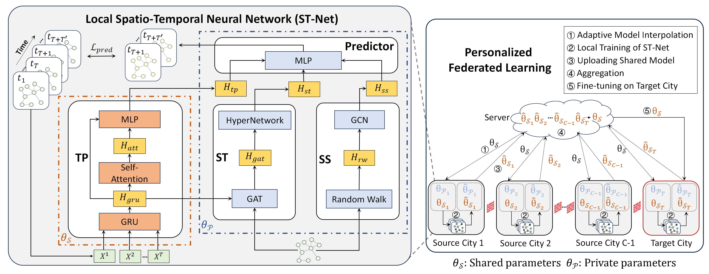

# Personalized Federated Learning for Cross-city Traffic Prediction 
  

## Requirements
  
- Python >= 3.8  
- torch = 1.13.0
- numpy = 1.25.2
- tqdm
- sklearn
- scipy
  
## Datasets  
  
Please refer to [ST-GFSL](https://github.com/RobinLu1209/ST-GFSL)
- PEMS-BAY  
- METR-LA
- Didi-Chengdu
- Didi-Shenzhen
  
## Training  
  ```python
# run pFedCTP 
python main.py --algo=pFedCTP --batch_size=32  --target_city=shenzhen --num_rounds=90 --local_epochs=150 --target_epochs=50 --gcn_layers=1
# run pFedCTP-woF
python main.py --algo=pFedCTP-woF  --batch_size=32  --target_city=shenzhen --num_rounds=90  --local_epochs=150 --gcn_layers=1
# run pFedCTP-Trans
python main.py --algo=pFedCTP-Trans --batch_size=32  --target_city=shenzhen --num_rounds=90  --target_epochs=50 --gcn_layers=1
   ```
  
## Citation  
  If you find this repository, e.g., the paper, code, and the datasets, useful in your research, please cite the following paper:
