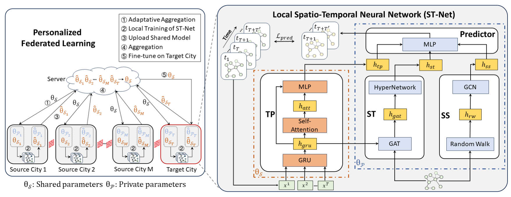

# Personalized Federated Learning for Cross-city Traffic Prediction 
  

## Requirements
  
- Python >= 3.8  
- torch = 1.13.0
- numpy = 1.25.2
- tqdm
- sklearn
- scipy
  
## Datasets  
  
We use the same dataset as 
  
## Training  
  ```python
# run pFedCTP
python main.py 
# run pFedCTP-woF
python main.py
# run pFedCTP-Trans
python main.py
   ```
  
## Citation  
  If you find this repository, e.g., the paper, code and the datasets, useful in your research, please cite the following paper:
